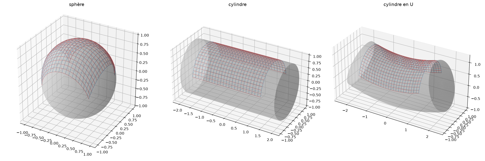

# drapage

Drapé géométrique d'un tissu sur une surface 3D (algorithme *fishnet* / filet de Tchebychev).

Le tissu est une grille N×M de nœuds reliés par des fils inextensibles : seule la
variation d'angle entre chaîne et trame (cisaillement) est permise. L'objet est un
maillage triangulaire (`vertices` V×3, `faces` F×3). La sortie est la position 3D
de chaque nœud du tissu posé sur l'objet.

```python
from fishnet import drape
P = drape(vertices, faces, shape=(21, 21), spacing=0.1)  # -> (21, 21, 3), NaN si non posé
```

## Démo

```bash
python -m venv .venv && .venv/bin/pip install -r requirements.txt
.venv/bin/python demo.py   # sphère, cylindre, cylindre en U -> drape.png
```



## Visualisation ligne par ligne

Le tissu est construit ligne par ligne le long de son axe X (axe 0 de la grille,
fils de chaîne) : la ligne centrale d'abord, puis les lignes d'un côté, puis de l'autre.

```bash
.venv/bin/python viewer.py sphere            # ou : cylindre, cylindre_u
.venv/bin/python viewer.py cylindre_u --bend 4   # rayon de courbure du U
.venv/bin/python viewer.py sphere --shape 15 15 --spacing 0.1
```

| Touche | Action |
|---|---|
| `→` / `←` | ligne suivante / précédente |
| `Espace` | lecture / pause |
| `Début` / `Fin` | première / dernière ligne |
| `+` / `-` | vitesse de lecture |
| `c` | couleur des fils selon le cisaillement |

La ligne posée est en noir ; les fils de trame qui la relient à la ligne précédente en orange.
`drape(..., return_history=True)` renvoie aussi l'ordre de pose des lignes.

## Limites

Maillage fermé, normales vers l'extérieur, courbures douces par rapport au pas du tissu
(sphère, cylindre, cylindre en U…).
